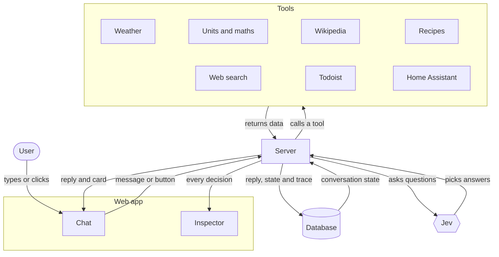
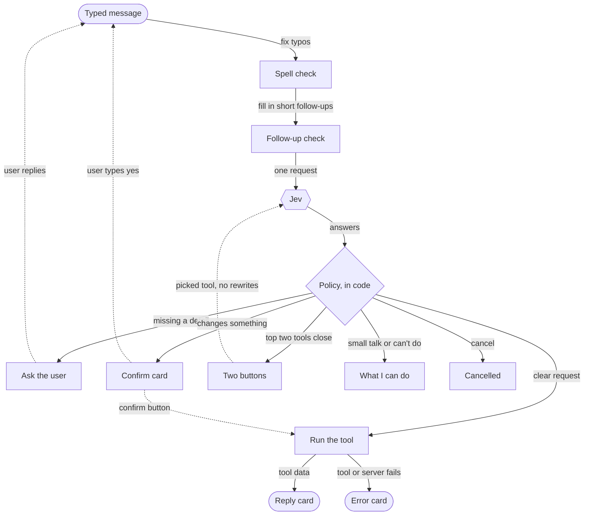
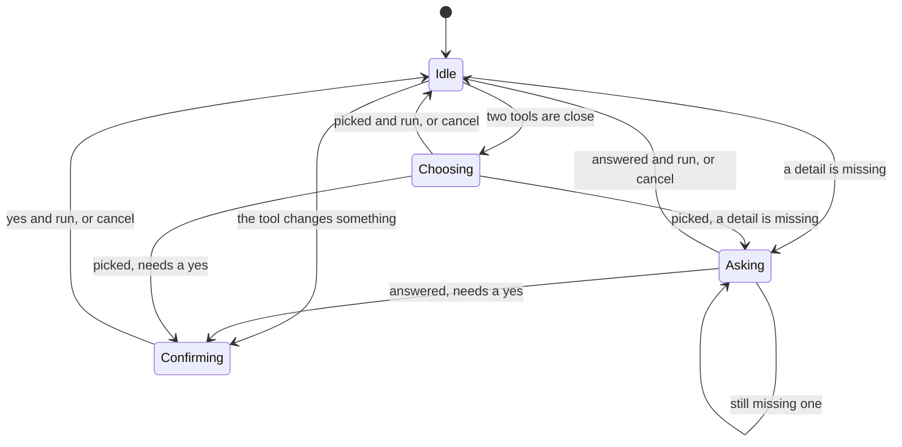
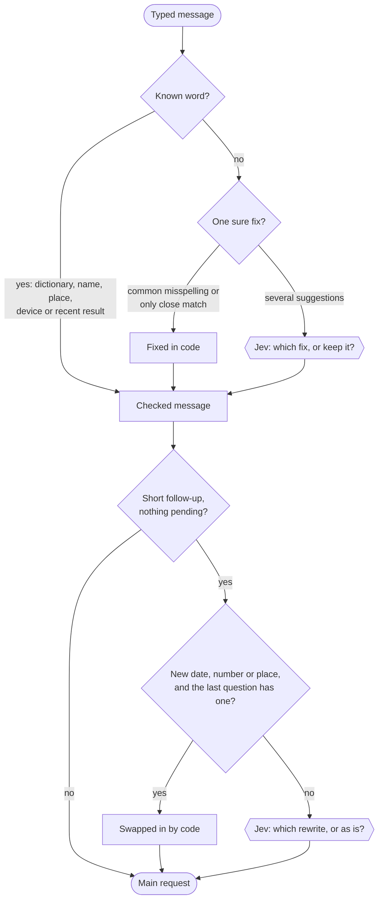
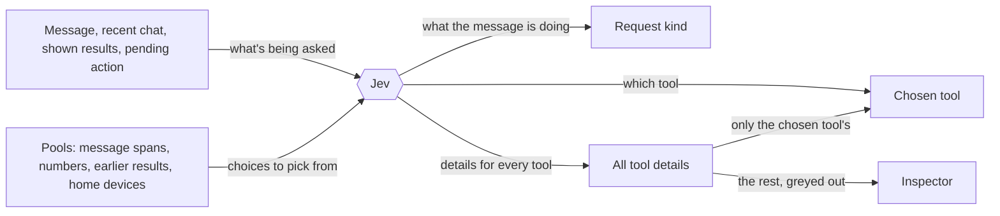
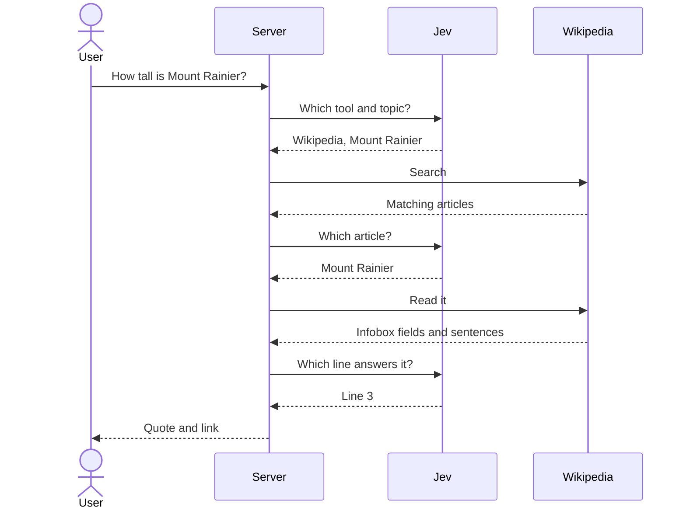
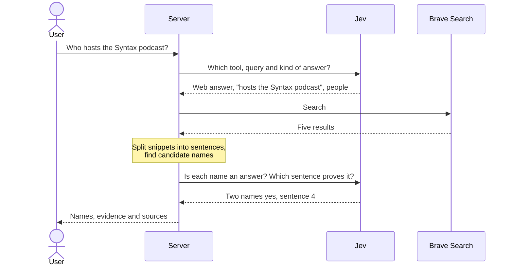

# Jev Chat

A chat-shaped command bar that calls real tools, **without an LLM writing anything.**

Every turn, a classifier picks: what was asked, which tool to call, which value goes in each
argument, whether to confirm first, and what kind of reply to give. Code does the rest: it calls
the MCP servers and builds the reply from the tools' own data. Because no model ever writes the
text, **the assistant cannot invent a fact**: every value on screen was either typed by the user or
returned by a tool.

An inspector pane shows the whole decision for any reply: the request, every question, every
probability, and what the code did with the answers.

- [Jev Chat](#jev-chat)
  - [What is Jev?](#what-is-jev)
  - [Run it](#run-it)
  - [How it works](#how-it-works)
  - [Adding a tool](#adding-a-tool)
  - [Layout](#layout)
  - [Notes](#notes)
  - [FAQ](#faq)
  - [References and resources](#references-and-resources)
  - [Contributing](#contributing)

## What is Jev?

[Jev](https://docs.typesafe.ai) is a classifier from TypeSafe. You hand it some state and a set of
named questions; it answers each one by choosing among options you supply. This app uses two of
its question types:

| Type       | Question                                  | Answer                                             |
| ---------- | ----------------------------------------- | -------------------------------------------------- |
| **Choice** | "Which of these tools fits?"              | one option key, with probabilities for all of them |
| **Noul**   | "Does the user say when the task is due?" | a probability that the answer is yes               |

Jev does not produce text. Every text argument, such as a search query, a task title or a city, is
copied from the user's message, the conversation or an earlier tool result.

## Run it

You need Node 24 or later and pnpm 11 (`corepack enable` picks up the version pinned in
`package.json`). `better-sqlite3` is a native module; if no prebuilt binary matches your platform,
`pnpm install` compiles it and needs a C++ toolchain.

```sh
pnpm install
cp .env.example .env   # fill in the keys you have
pnpm dev               # server :8787, web http://localhost:5173
```

Only `TYPESAFE_API_KEY` is required. Jev is a paid API: get a key from the
[TypeSafe console](https://console.typesafe.ai/settings/keys). Without one the app still starts, but
every message gets an error reply. Other servers without a key show as "no key" in the sidebar and
everything else keeps working, so weather, units, Wikipedia and recipes need nothing beyond the Jev
key.

The API has no login, so it listens on `127.0.0.1` only and refuses requests addressed to, or sent
from a page on, any host other than `localhost`, `127.0.0.1` or `[::1]`. Open the app on this
machine. This is a dev setup: `pnpm build` only builds the web app, and nothing serves the built
files.

| Server                                                     | Needs                                                    |
| ---------------------------------------------------------- | -------------------------------------------------------- |
| Weather (`packages/mcp-weather`, Open-Meteo)               | nothing                                                  |
| Units & maths (`packages/mcp-units`)                       | nothing                                                  |
| Wikipedia (`packages/mcp-wiki`)                            | nothing                                                  |
| Recipes (`packages/mcp-recipes`, TheMealDB)                | nothing (public test key; `MEALDB_API_KEY` for your own) |
| Brave Search (`@brave/brave-search-mcp-server`)            | `BRAVE_API_KEY`                                          |
| Todoist (`@doist/todoist-ai`)                              | `TODOIST_API_KEY`                                        |
| Home Assistant (its MCP Server integration, at `/api/mcp`) | `HASS_URL`, `HASS_TOKEN`                                 |
| Jev itself                                                 | `TYPESAFE_API_KEY`                                       |

Some things to try:

- What's the weather in Denver tomorrow?
- 350F in celsius, or: What's a 20% tip on $64?
- How tall is Mount Rainier?
- Something vegan for dinner, then: How do I make the first one?
- Who hosts the Syntax podcast?
- Remind me to renew my passport tomorrow
- Turn off the kitchen lights

Conversations are stored in SQLite at `apps/server/jev-chat.db` (`DATABASE_PATH` is relative to
`apps/server`). Delete the file to start over.

```sh
pnpm test          # unit tests; no network or API keys needed
pnpm typecheck
pnpm lint          # oxlint; lint:fix to apply fixes
pnpm format        # oxfmt; format:check to only check
pnpm tools:list    # what each connected MCP server exposes (add -- --schema for input schemas)
```

This app only works in English. See `ASSISTANT_TZ` and `DEFAULT_UNITS` in `.env.example` for the
locale settings you can configure.

## How it works

### How a turn flows



The server is Hono; the web app talks to it over Hono RPC. Conversations and every trace go into
SQLite via drizzle. Each turn loads the conversation's state (what it's waiting on, the last result
and the recent chat), and the reply comes back with its trace, so the inspector never waits on a
second request.

### One message, start to finish



This is `handleTurn` in **`apps/server/src/turn/turn.ts`**, which takes both typed messages and
button clicks. Up to two small Jev requests run first (`turn/preprocess/`, see
[Pre-processing](#pre-processing)). Then the main request, then the policy, which is plain code
reading Jev's answers in order: cancel or confirm a pending action, small talk, which tool (two
buttons when its confidence is below `CONFIDENT` and the runner-up is within `CLOSE_MARGIN`), a
missing argument, a confirmation, and finally the call.

Buttons skip the rewrites. A confirm click runs the stored arguments without asking Jev again; a
tool pick re-runs the main request with that tool forced, so it can still ask or confirm.

### What a conversation can wait on



The waiting state is `pending` on the conversation (`shared/state.ts`). Jev sees it described in the
request and answers `request_kind`: `new_request`, `answers_pending`, `confirm_yes`, `cancel`,
`chat` (small talk) or `unsupported`. A new request drops the pending action and is handled from
scratch. The web app only enables the newest reply's buttons; on the server, a click that doesn't
match what's pending gets "That button has expired." ("Nothing to do." when nothing is pending).

### Pre-processing

Before the main request, a typed message goes through two rewrites: spell check, then follow-ups.
Both do what they can in code and only ask Jev to choose when there's more than one reading. The
inspector shows the original message, what changed and who decided.



This is `correctSpelling` and `resolveFollowUp` in `turn/preprocess/preprocess.ts`. Neither runs
for a button click or without a Jev key, spell check can be switched off in the sidebar, and if
either Jev request fails the step is skipped and the message goes on as it was.

**Spell check** (`preprocess/spelling.ts`) looks words up in cspell's English, company and software
dictionaries. It skips short words, anything compromise tags as a name, acronym, link or hashtag,
[place names](#names-and-places), Home Assistant device and area names, and words from recent
results. Then, for each unknown word:

- a listed common misspelling with a single fix, or a lowercase word with exactly one suggestion
  one edit away, is fixed without Jev
- anything else (up to six words) becomes a Choice between up to four suggestions and "keep it as
  typed", which Jev answers with the whole message in view

**Follow-ups** (`preprocess/followup.ts`) only apply to a short message that leans on the previous
one ("what about Boston?", "and tomorrow?", "the second one") when nothing is pending:

- if the new content is a date (chrono), a number or a place, and the previous question has exactly
  one of that kind, it's swapped in without Jev: "weather in Denver?" then "what about Boston?"
  becomes "weather in Boston?"
- otherwise code writes every rewrite of the previous question that replaces a one- or two-word
  span with the new content, or appends it, and Jev picks one or keeps the message as it is

### Language tools

Three libraries read the text before Jev sees it:
[compromise](https://github.com/spencermountain/compromise),
[chrono-node](https://github.com/wanasit/chrono) and
[cspell-lib](https://github.com/streetsidesoftware/cspell). None of them writes anything: they find
words, spans and suggestions, which code either applies as a sure fix or offers to Jev as options.

| Library     | Finds                                                                         | Used by                                     |
| ----------- | ----------------------------------------------------------------------------- | ------------------------------------------- |
| compromise  | names, acronyms and links; places; numbers in words ("twenty six"); sentences | spell check, follow-ups, pools, web answers |
| chrono-node | date phrases ("next Friday", "tomorrow at 5")                                 | pools, follow-ups, web answers              |
| cspell-lib  | known words, common misspellings, suggestions                                 | spell check                                 |

### One request, many questions



`buildRequest` in `turn/request.ts` asks every tool's questions in one round trip, before it knows
which tool will be used. The code reads the answers for the tool that was picked and ignores the
rest, and the inspector greys those out. When the message answers a pending question or comes from
a tool button, the tool is already known and the "which tool?" answer is ignored.

The options come from `buildPools` in `apps/server/src/jev/pools.ts`: date phrases, word spans
and numbers from the message; titles and items ("the first one") from the newest result; numbers
and short arguments from the last three results; and the message behind a pending question. The
smart-home devices come from `homeTargetPool` in `tools/home/catalog.ts`. Jev sees each option
under a key like `t3`; code maps the key back to its value and `Args` records where it came from.
Jev can only pick from these pools, so they are the only values that can end up in a text
argument.

### A multi-step tool



Some tools need more than one call. They are a `MultiStepAdapter`: they implement `run()` instead
of `present()` and drive their own sequence. See `wikiFact` in
**`apps/server/src/tools/wiki/wiki.ts`** and `runMultiStep` in `turn/execute.ts`. The reply quotes
the chosen line word for word. If the article is a disambiguation page, the reply lists its meanings
instead, and the user can pick one next turn.

### Answering from the web



`webAnswer` in `tools/search/search.ts` is the other multi-step tool. The main request also picks
the kind of answer wanted: people, a number, a date, a place, or something else. Code finds
candidates of that kind in the search snippets, then a single Jev request judges them and picks the
sentence that proves the answer. People get one Noul each, since more than one can be right; the
other kinds get one Choice. For "something else" there are no candidates and Jev only picks the
sentence.

### Names and places

The candidate finders in `tools/search/extract.ts` are plain code (regexes, chrono-node and
compromise). They cast a wide net and leave the judging to Jev:

| Kind   | Candidates                                                                        |
| ------ | --------------------------------------------------------------------------------- |
| People | two- and three-word windows of capitalised runs, without non-name words or places |
| Number | numbers, with any currency symbol and unit ("14,406 ft", "$4.5 million")          |
| Date   | full dates via chrono-node, plus bare years and month-years                       |
| Place  | capitalised spans of one to three words, known places ranked first                |

Each list is ranked by how often it appears across the sources. Accepted people that overlap
("Wes Bos Scott" and "Wes Bos") are deduplicated by score.

"Known places" is `isPlace` in `tools/search/places.ts`: about 1,900 countries, capitals and
subdivisions in `places.txt` (compared without case or accents), plus shapes like "Mount …",
"Lake …" and "… County". The same check keeps spell check off place names, lets a follow-up swap
one place for another, and keeps places out of the people list.

## Adding a tool

Each tool is an adapter, one object per tool, in `apps/server/src/tools/<server>/`, with one folder
per MCP server. The contract is in **`tools/kit/adapter.ts`** and has three phases:

```ts
export const myTool: SingleStepAdapter = {
  id: "myserver.do_thing",
  server: "myserver",
  mcpName: "do_thing",
  label: "Do the thing",
  description: 'Shown to Jev as the option for the "which tool?" question',
  examples: ["Do the thing to my stuff"],

  // 1. what to ask Jev: options only, never free text
  questions: (pools) => ({
    target: candidateQ("Which thing?", pools.text, "No thing named"),
    mode: choiceQ("How thoroughly?", { quick: "A quick pass", deep: "Properly" }),
  }),

  // 2. turn the answers into MCP arguments, and say where each one came from
  build(a, pools) {
    const args = new Args(a);
    args.pick("target", pools.text); // a value Jev chose out of a pool
    args.option("mode", "quick"); // a Choice that is itself an argument
    return args.require("target", "Which thing?"); // asks the user when it's missing
  },

  // 3. turn the result into a reply and a card
  present(result) {
    const data = readResult(result, myResultSchema, "do_thing");
    if (!data) return rawFallback(result);
    return {
      text: `Did it to ${data.name}.`,
      card: { type: "action", title: "Done", lines: [], ok: true },
    };
  },
};
```

`Args` (`tools/kit/args.ts`) builds the MCP arguments and the inspector's argument trace together.
To send and show different things, read the answer with `choice`/`candidate` and record it with
`set` (send it and show it), `fixed` (send only) or `note` (show only). When `option` falls back to
its default, the trace credits the code (`default`) rather than Jev.

The sample assumes `myserver` is already a `ServerId`. Then add the adapter to the list in
`tools/index.ts`. To add a whole MCP server, you also need an entry in
`SERVERS` (`mcp/clients.ts`) and a new member of `ServerId` + `SERVER_LABELS` (`shared/servers.ts`).

Adapters are tested without Jev or a network: `tools/kit/testkit.ts` fakes Jev's option picks, so a
test names the option it wants and asserts on the arguments that come out. See `tools/*/*.test.ts`.

Two conventions to be aware of:

- **Adapter ids mirror upstream MCP tool names**: `weather.get_weather`, `todoist.add-tasks`,
  `home.HassTurnOn`. Multi-step tools are named for what they do (`wiki.answer`, `search.answer`).
- **An argument starting with `__`** is a private hint for the adapter: it feeds `confirm`,
  `present` or `run`, is never sent to the MCP server, and isn't stored with the result.
  Single-step calls also drop any argument the server's input schema doesn't declare
  (`execute.ts`).

## Layout

```
apps/server/
  drizzle/          generated SQL migrations, applied at boot
  src/
    app.ts          routes (exports AppType for the web app's RPC client)
    config.ts       thresholds, locale, history sizes (the shared tuning knobs)
    index.ts        boot: connect MCP servers, load the HA catalog, serve
    db/             drizzle schema and the SQLite connection; runs the migrations
    jev/
      client.ts     askJev, the single entry point for Jev requests
      pools.ts      the options Jev may pick from
      questions.ts  question builders and answer readers
    turn/
      turn.ts       the policy: run, ask, confirm, offer a choice, or decline
      request.ts    the main request: the conversation as Jev sees it, and every question
      execute.ts    call the tool (or drive a multi-step one) and present the result
      outcome.ts    the reply type a turn returns
      preprocess/   the rewrites that run first: preprocess.ts runs spelling.ts and followup.ts
    mcp/clients.ts  MCP server registry and connections
    shared/         types shared with the web app: servers, state, cards, trace
    lib/errors.ts   the message of anything thrown
    scripts/        tools:list and places:build
    tools/
      index.ts      the adapter registry
      kit/          adapter.ts / args.ts / testkit.ts, shared by every adapter
      <server>/     one folder per MCP server; home/catalog.ts holds the device list, search/ the
                    candidate finders and places
apps/web/src/
  main.tsx              routes and providers
  api.ts                the Hono RPC client
  queries.ts            TanStack Query hooks for conversations, tools and turns
  store.ts              UI preferences (panels, spell check), kept in localStorage
  jevTrace.ts           totals across a turn's Jev requests
  routes/               the layout with the tools sidebar, and the new-chat page
  features/chat/        the conversation
  features/inspector/   the trace viewer
  components/cards/     reply cards, behind a registry
  components/ui/        generic UI pieces
packages/
  mcp-kit/          helpers the MCP servers share
  mcp-*/            four MCP servers written for this demo: weather, units, wiki, recipes
```

## Notes

- `pnpm --filter @jev-chat/server db:generate` after changing `db/schema.ts`; the generated SQL in
  `apps/server/drizzle/` is committed and applied at boot.
- `pnpm --filter @jev-chat/server places:build` regenerates `tools/search/places.txt` after bumping
  `provinces` or `countries-list`.
- Tool results are untrusted input: a web page can contain text aimed at the assistant. Jev can't be
  talked into writing a tool call, but keep the policy checks in code.

## FAQ

### Is there really no LLM?

None. Jev is a model, but not a generative one: it answers questions by picking among options the
code supplies, with a probability for each. It never returns text. Every reply is built by code from
what the user typed or what a tool returned.

### Is one of the tools an LLM, for the explanations?

No. The Wikipedia answers are quotes. Jev picks the topic, then the article, then the line of the
article that answers the question (a sentence or an infobox field, from up to the first 120 lines).
The reply quotes that line word for word and links the article. The idea comes from TypeSafe's
[line-by-line search](https://docs.typesafe.ai/cookbooks/semantic_find) cookbook.

### How does it pick the tool and the arguments?

One Jev request per message. A Choice lists every tool with a description and examples. Each tool
adds its own questions, whose options are spans and numbers from the message, earlier results and,
for the smart home, known devices. Code maps each pick back to its value. See
[One request, many questions](#one-request-many-questions).

### What happens when it can't decide?

When Jev isn't confident about the tool and the runner-up is close (`CONFIDENT` and `CLOSE_MARGIN`
in `config.ts`), you get a button for each of the two. A missing detail gets a question back. Small
talk and requests no tool covers get a fixed reply listing what it can do.

### What if it picks the wrong thing and changes something?

It can: routing is a model's judgment, not a rule. So adding or completing a Todoist task, and any
Home Assistant action that could reach a lock, a cover or an unknown device, shows a confirm card
with its arguments first. Only a yes runs it.

### "No hallucinations", really?

It can't invent a value: every value on screen was typed by the user or returned by a tool, and the
reply wording is fixed by code. It can still pick the wrong tool, the wrong span or the wrong line,
and a tool can return wrong data. The inspector shows every question, option and probability, so
you can see why.

### Can it reason or deduce?

No. Jev makes each judgment in one pass. Anything that needs working out goes to code or a tool:
maths and unit conversions go to the units tool, and dates are worked out in code.

### Can it handle compound requests, like "turn the light green, then red after 5 seconds"?

Not yet. Each message runs one tool, and there's no timer tool. Adding one is an adapter, but
splitting one message into several commands would need its own step before Jev.

### Isn't this just Siri? Every response is pre-coded.

Partly: it can only do what its tools do, and each tool's reply is templated. Understanding the
request isn't pre-coded: there are no keyword rules or intent grammars for picking the tool or its
arguments. What you get in return is that it can't make up a fact and shows every decision. Adding a
tool is one adapter ([Adding a tool](#adding-a-tool)).

### Is it built on LangChain or an agent framework?

No. The pipeline is plain TypeScript: a Hono server, the MCP SDK for the tools, and the TypeSafe SDK
for Jev. Each turn starts in `handleTurn` (`turn/turn.ts`).

### Can I run it?

Yes. You need a TypeSafe API key (Jev is paid); every other tool is optional. See
[Run it](#run-it).

### Where can I learn more?

The explainer video [wtf is jev?](https://www.youtube.com/watch?v=QbYBRjOaGOo),
[TypeSafe's docs](https://docs.typesafe.ai) and [How it works](#how-it-works) above.

## References and resources

### Jev and TypeSafe

- [TypeSafe](https://typesafe.ai/) and its
  [Manifesto](https://typesafe.ai/manifesto)
- [Introducing System One models and Jev](https://typesafe.ai/blog/introducing-system-one-models-and-jev)
- Docs: [Introduction](https://docs.typesafe.ai/introduction),
  [Quick start](https://docs.typesafe.ai/introduction/quickstart),
  [System One](https://docs.typesafe.ai/concepts/system-one),
  [How to build with TypeSafe](https://docs.typesafe.ai/concepts/how-to-build-with-system-one),
  [State](https://docs.typesafe.ai/concepts/state)
- Questions: [Primitives](https://docs.typesafe.ai/primitives),
  [Choice](https://docs.typesafe.ai/primitives/choice), [Noul](https://docs.typesafe.ai/primitives/noul),
  [Confidence](https://docs.typesafe.ai/confidence)
- [JavaScript SDK](https://docs.typesafe.ai/sdk/javascript)
  ([source](https://github.com/typesafe-ai/typesafe-sdk-js))
- [Agent skill](https://docs.typesafe.ai/agent-skill) ([source](https://github.com/typesafe-ai/skills))
  and [llms.txt](https://docs.typesafe.ai/llms.txt)
- [Playground](https://console.typesafe.ai/playground) and
  [workflow evals](https://evals.typesafe.ai/)
- [wtf is jev?](https://www.youtube.com/watch?v=QbYBRjOaGOo), an explainer video

### Patterns and cookbooks this app follows

- [Intent routing](https://docs.typesafe.ai/patterns/intent-routing): picking the tool
- [Speculative fan-out](https://docs.typesafe.ai/patterns/fan-out): every tool's questions in one
  request
- [Confidence-gated routing](https://docs.typesafe.ai/patterns/confidence-routing): two buttons
  instead of a guess
- [Function calling](https://docs.typesafe.ai/cookbooks/function_calling): tool arguments, and a
  Noul for whether an optional one is stated
- [Pre-parsed value extraction](https://docs.typesafe.ai/cookbooks/pre_parsed_value_extraction_cookbook):
  code finds the candidates, Jev picks
- [Date extraction](https://docs.typesafe.ai/cookbooks/date_extraction_cookbook): Jev picks the date
  parts, code does the calendar maths
- [Line-by-line search](https://docs.typesafe.ai/cookbooks/semantic_find): the Wikipedia quotes
- [Smart home assistant demo](https://docs.typesafe.ai/demos/smart-home): the Home Assistant tool
  and the inspector

### MCP servers and APIs

- [MCP tools specification](https://modelcontextprotocol.io/specification/2025-06-18/server/tools)
- [Brave Search MCP server](https://github.com/brave/brave-search-mcp-server)
- [Todoist MCP server](https://github.com/Doist/todoist-mcp)
- Home Assistant's [MCP Server](https://www.home-assistant.io/integrations/mcp_server/) and
  [Demo](https://www.home-assistant.io/integrations/demo/) integrations
- [Open-Meteo](https://open-meteo.com/), the
  [MediaWiki Action API](https://www.mediawiki.org/wiki/API:Main_page) and
  [TheMealDB](https://www.themealdb.com/api.php)

## Contributing

This repo is a demo and proof of concept. If you find a correctness issue or a clear error, open an
issue and I'm happy to discuss it, but I won't accept PRs for new features. To add features, fork
the repo or point your agent at it for inspiration.

## License

The code is [MIT](LICENSE). The data the tools fetch comes with its own terms:

- Weather data from [Open-Meteo](https://open-meteo.com/) under
  [CC BY 4.0](https://creativecommons.org/licenses/by/4.0/); its free API is for non-commercial use.
  Place lookup uses Open-Meteo's geocoding, which is based on [GeoNames](https://www.geonames.org/)
  (CC BY 4.0).
- Article text from [Wikipedia](https://en.wikipedia.org/) under
  [CC BY-SA 4.0](https://creativecommons.org/licenses/by-sa/4.0/). Each quote links to its
  article, and the test fixtures in `packages/mcp-wiki/src/fixtures/` are Wikipedia wikitext under
  the same licence.
- Recipes from [TheMealDB](https://www.themealdb.com/api.php). The default test key `1` is for
  development and educational use; get your own key for anything else.
- Brave Search and Todoist are used through their own MCP servers and your own accounts.
